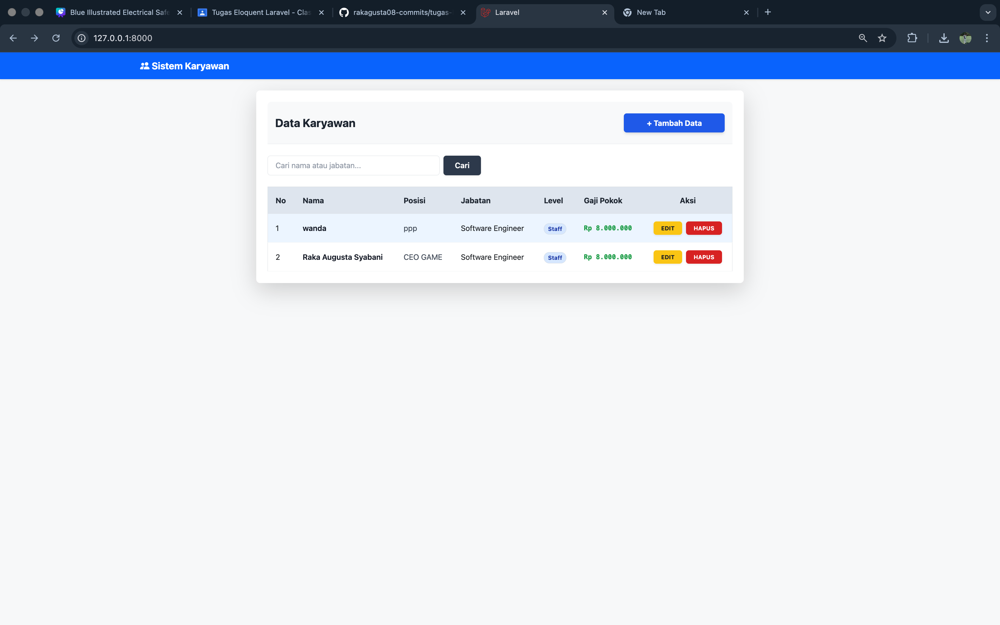

# 🏢Sistem Manajemen Karyawan - SMKN 4 Bandung

Tugas mandiri pengembangan aplikasi web berbasis framework Laravel untuk mengelola data SDM secara dinamis.

##  Identitas Pengembang
* **Nama:** Raka Augusta Syabani (Gustavo)
* **Kelas:** XI RPL (Software Engineering)
* **Sekolah:** SMKN 4 Bandung

---

##  Fitur & Pencapaian Tugas
Berikut adalah poin-poin yang telah berhasil diselesaikan sesuai instruksi:

1. **Model & Relasi Baru**: Berhasil menambahkan Model `Jabatan` yang terhubung langsung dengan tabel `Karyawan`.
2. **Join Data**: Halaman utama menampilkan hasil join antara data Karyawan dan Jabatan (Nama, Level, dan Gaji Pokok).
3. **Fitur Search**: Menambahkan fungsionalitas pencarian nama karyawan secara real-time melalui query builder.
4. **Custom Style**: Tampilan web dirombak menggunakan **Tailwind CSS** agar terlihat modern, bersih, dan responsif.

---

## 📸 Hasil Pengerjaan (Preview)
Berikut adalah tampilan antarmuka aplikasi yang sudah dijalankan di localhost:

> **Catatan:** Jika gambar tidak muncul, pastikan kamu sudah mengupload file foto hasil screenshot kamu ke GitHub dengan nama `screenshot-web.png`.

---

##  Teknologi yang Digunakan
* **Backend:** PHP 8.x & Laravel 13
* **Frontend:** Tailwind CSS (via CDN/Vite)
* **Database:** MySQL
* **Tools:** Visual Studio Code & Git